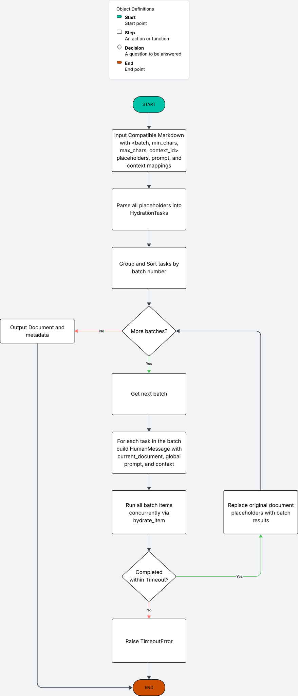
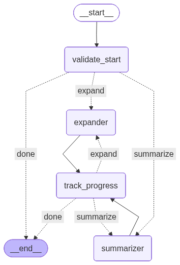

<div align="center">


[](https://beckettfrey.github.io/doc-weaver-agent/doc_weaver.html) [](./example-template.md) 

</div>

## Appendix

- [How It Works](#how-it-works)
- [What Problems Does This Solve?](#what-problems-does-this-solve)
- [Placeholder Syntax](#placeholder-syntax)
- [CLI Usage](#cli-usage)
- [Project Structure](#project-structure)

---

Doc Weaver fills `<batch, min_chars, max_chars>` placeholders in markdown templates with LLM-generated content that respects character-length constraints. Batches run sequentially so later placeholders see earlier results, while items within a batch run concurrently.

## How It Works



### Pipeline Details

1. **HydrateQueue** (`hydrate_queue.py`) parses all placeholders, replaces them with unique `<<TASK_N>>` markers, and groups tasks by batch number.
2. Batches process sequentially (lower batch first). Within a batch, all items run concurrently via `asyncio.gather`.
3. For each task, the queue builds a `Document` where the current task's marker becomes `<TODO>` and all other unresolved markers become `(will be filled later)`. This gives the LLM full document context.
4. **hydrate_item** (`hydrate_batch.py`) calls the LLM via structured output (Pydantic `Response` model), then runs the text morpher if the result falls outside the character bounds.
5. Results feed back into the queue; subsequent batches see prior results in the document.

### Text Morpher

[`text_morpher/`](./src/doc_weaver/text_morpher/) is a LangGraph state machine that iteratively summarizes or expands text to fit `[min_chars, max_chars]`. The graph loops through summarizer/expander nodes with a configurable retry budget (default 3).

<div align="center">



</div>

## What Problems Does This Solve?

**Format and length constraints.** Free-form generation gives you little control over how much text ends up in each section. Doc Weaver anchors every placeholder to explicit character bounds (`min_chars`, `max_chars`), and the text morpher enforces those bounds automatically. The template itself locks down heading hierarchy, section order, and overall document shape, so the output matches a predefined format every time.

**Sequentially improved context.** Because batches run in order, each generation step sees the resolved output of every earlier batch. Later sections build on top of what was already written rather than guessing at it. This gives the model an increasingly complete picture of the document as it fills in remaining placeholders, producing a more coherent and internally consistent result.

**Grounded output, not hallucination.** LLMs generating long-form documents from a single prompt tend to drift, fabricate details, or lose coherence. Doc Weaver breaks the problem into one placeholder at a time: each LLM call receives a full document preview with a single `<TODO>` marking exactly where to write, combined with the user-supplied prompt, this gives the model a narrow, well-defined task against concrete surrounding content rather than open-ended generation.

## Placeholder Syntax

Placeholders follow the format `<batch, min_chars, max_chars>`:

| Field | Description |
|-------|-------------|
| `batch` | Processing order. Batch 1 runs first, then batch 2, etc. |
| `min_chars` | Minimum character count for the generated text. |
| `max_chars` | Maximum character count for the generated text. |

Items sharing the same batch number run concurrently. Lower batch numbers run first, so their results are visible to later batches.

### Required Markdown Structure

Templates must follow this hierarchy pattern:

```
# Title
> Tagline

## Section
### Subsection
- Content item
- Content item
```

- Exactly one `# Title` heading
- Zero or One `> Tagline` line immediately after the title
- Zero or more `## Section` headings
- Zero or more `### Subsection` headings per section
- Zero or more `- Content` items per subsection

Placeholders can appear on at any level.

[load_markdown](./src/doc_weaver/parser.py) produces a `Document` object (from `doc_weaver.document`) with `header`, `tagline`, and `sections` attributes. Each section maps to a list of `SubSection` objects containing `Content` items. Call `document.preview()` to render the document back to markdown. `Document` can be used for programmatic tasks like custom rendering or post-processing of your generated documents.

## CLI Usage

Doc Weaver installs a `doc-weaver` command. This serves as a wrapper around the flowchart functionality, and lets you manage versions with ease.

### Configure

Store configuration values (such as your OpenAI API key) in `~/.doc_weaver/.env`:

```bash
# Set a config value
doc-weaver config set OPENAI_API_KEY sk-...

# View stored config (values are masked)
doc-weaver config show
```

The config file is created with `600` permissions. Values set here are loaded automatically on every `doc-weaver` invocation.

### Validate a Template

Check that a markdown file has valid structure and well-formed placeholders before using it:

```bash
doc-weaver validate ./my-template.md
```

On success, prints a summary of placeholders and batches. On failure, lists all errors found and exits with code 1.

### Template Management

```bash
# Save a template
doc-weaver template add resume-template ./my-template.md

# List saved templates
doc-weaver template list

# View a template
doc-weaver template show resume

# Delete a template
doc-weaver template remove resume
```

Templates are stored in `~/.doc_weaver/templates/`.

### Generate a Document

```bash
doc-weaver generate resume-template \
    --output-dir ./output \
    --prompt "Here are the jobs I've held... and here is the job I'm optimizing for..." \
    --model gpt-4o \
    --timeout 30
```

| Option | Description |
|--------|-------------|
| `--output-dir` | Directory for `output.md` and `metadata.json` (required). |
| `--prompt` | Context string passed to the LLM for all placeholders. |
| `--prompt-file` | Read context from a file instead (mutually exclusive with `--prompt`). |
| `--model` | OpenAI model to use (default: `gpt-4o`). |
| `--timeout` | Seconds to wait per batch (default: `30`). |


Each generation run writes a `metadata.json` alongside `output.md`. This file records per-task diagnostics so you can inspect exactly what happened during generation:

```json
{
  "tasks": [
    {
      "task_number": 0,
      "marker": "<<TASK_0>>",
      "batch_num": 1,
      "char_range": [1, 50],
      "total_chars": 50,
      "elapsed_ms": 11541.36,
      "model": "gpt-4o"
    }
  ],
  "total_elapsed_ms": 14326.47,
  "model": "gpt-4o",
  "marker_document": "# <<TASK_0>>\n> <<TASK_1>>\n## Section\n"
}
```

| Field | Description |
|-------|-------------|
| `task_number` | Index of the placeholder in parse order. |
| `batch_num` | Which batch the task belonged to. |
| `char_range` | The `[min_chars, max_chars]` constraint from the placeholder. |
| `total_chars` | Actual character count of the generated text. |
| `elapsed_ms` | Wall-clock time for that task (including any morph retries). |
| `total_elapsed_ms` | Wall-clock time for the entire generation run. |
| `marker_document` | The template with placeholders replaced by their `<<TASK_N>>` markers, useful for mapping tasks back to document positions. |

This is helpful for debugging length violations, spotting slow tasks, comparing models, and understanding how the template was decomposed into tasks.
## Project Structure

```
src/doc_weaver/
  cli.py              # Click CLI (template management + generate)
  document.py         # Data models: Document, SubSection, Content
  parser.py           # Markdown parser with structural validation
  hydrate_queue.py    # Orchestration: batch ordering, marker injection, hydrate()
  hydrate_batch.py    # Per-item hydration: LLM call + morph
  responder.py        # LangChain structured output (Task agent)
  text_morpher/
    __init__.py       # LangGraph definition, simple_morph() entry point
    state.py          # AgentState TypedDict
    nodes.py          # Graph nodes: validate, summarize, expand, track_progress
  test/
    test_parser.py
    test_hydrate_queue.py
    test_hydrate_batch.py
    ...
```